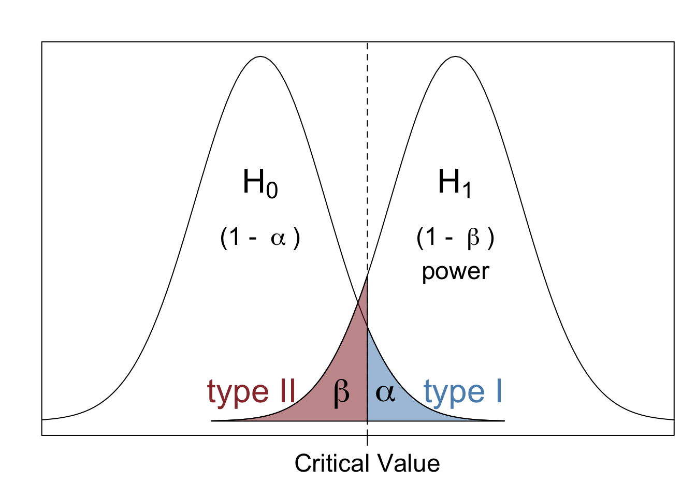

This post discusses type I and type II errors, along with power. Basic background knowledge regarding hypothesis testing and $p$-values is assumed in this post.

------------------------------------------------------------------------

# What are errors in hypothesis testing?

As discussed in [this](https://trgrimm.github.io/posts/2024/06/hypothesis-testing/) previous post, hypothesis testing is a statistical approach that is used to determine whether a specific hypothesis is supported by available data. One critical factor to consider whenever performing a hypothesis test is the probability of making a wrong decision, or an error. Since the entire purpose of hypothesis testing is to make well-informed data-driven decisions, making errors is not ideal.

The severity of different types of errors also varies depending on the situation. Therefore, it's important to understand the common types of errors that may occur in hypothesis testing and how to control those errors as much as possible. In this post, I will briefly cover the two important types of errors that may occur whenever conducting a hypothesis test: **type I** and **type II errors**. I'll also cover another important concept in hypothesis testing: **power**.

# What are type I and type II errors?

Type I and type II errors are errors that occur when we draw incorrect conclusions from a hypothesis test. Each of these errors has a chance of occurring in any hypothesis test. A **type I error** occurs when we incorrectly reject H0, and a **type II error** occurs when we fail to reject H0 when H1 is true. The probabilities of making type I and type II errors are denoted as $\alpha$ and $\beta$ respectively, and are defined as follows:
 
 * $\alpha$: the probability of rejecting H0 when H0 is indeed true (type I, false positive)
 * $\beta$: the probability of failing to reject H1 when H1 is indeed true (type II, false negative)
 
Another important measure to consider is the statistical **power**, which is defined as the probability of rejecting a false null hypothesis (correctly rejecting H0). Power is equal to $1 - \beta$. An ideal hypothesis test minimizes type I and II errors, which equates to minimizing the type I error while maximizing power.

To better understand the idea of power, consider a scenario where we want to compare the means of two populations, and the mean of population 2 is larger than the mean of population 1. Suppose we construct the following hypotheses:

**H0:** The means of the populations are equal.

**H1:** The mean of population 2 is larger than the mean of population 1.

In this situation, the power is the probability that we correctly conclude that the mean of population 2 is larger than the mean of population 1.

Because we want to ensure we correctly reject H0 the majority of the time, we commonly want the power to be around 80\% or 90\%, depending on the context of the problem.

# Vizualizing type I and II errors and power

The figure below is a visual representation of the null and alternative hypotheses for a one-sided hypothesis test, along with type I and type II errors and their corresponding regions. We see that if we decrease $\alpha$, the critical value will shift to the right. This shift will cause an increase in $\beta$, which is equivalent to a decrease in power.

As effect sizes increase, the distances between the distributions associated with H0 and H1 also increase, causing an overall decrease in both error probabilities and in increase in power.

    

Type I and type II errors for an upper-tailed hypothesis test. The probability of a type I error is $\alpha$ and the probability of a type II error is $\beta$..

In any situation, it is important to know the severity of each error type so that we can do our best to control the probability of the errors accordingly. To do this, it's essential to understand the factors that affect the power and error probabilities of a hypothesis test.

## Factors that affect power and errors

The factors that affect the power and error probabilities of a test were demonstrated in the figure in the previous section. As we saw, power depends on the following:

* effect size
* $\alpha$
* sample size

In practice, the effect size is unknown and isn't something we can set or change ourselves. So, realistically, we can increase power either by increasing $\alpha$ or by increasing the sample size.

The value of $\alpha$ should be small and equal to an acceptable false positive rate for the hypothesis of interest. Standard convention is to set $\alpha = 0.05$, but this value itself is not meaningful and is mostly done out of tradition; there's nothing magical that happens when a $p$-value equals 0.049 versus 0.051, which is a common misunderstanding. It's also important to remember that even when we achieve statistical significance ($p$-value is smaller than $\alpha$), the results may not be practically significant. This idea is discussed in a [previous post](https://trgrimm.github.io/posts/2024/06/hypothesis-testing/) on hypothesis testing.

The probability of a type I error is related to the probability of a type II error: as the probability of one error increases, the probability of the other error decreases. So, we can decrease the probability of a type II error by increasing $\alpha$, but this is not something that should typically be considered in practice.

# Conclusion

There are a lot of things to consider when designing and carrying out a hypothesis test. It is important to always consider statistical power and the probability of making type I and type II errors in order to mitigate risks and ensure correct decision-making. Effect sizes, desired power, values of $\alpha$, and sample sizes are key factors in this process.

